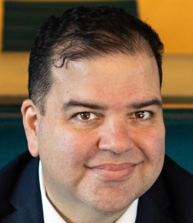

---
# Front matter (configuration for this page)
title: "Princeton Alumni Mental Health Council"
# This will be the title that appears in the browser tab and page header

# Set an explicit slug for a clean URL (e.g., yoursite.com/alumni-mental-health)
slug: "alumni-mental-health"

# Add this page to the main menu
menu:
  main:
    # Set the weight to control the order in the navigation bar.
    # Check your config.toml or other pages for existing weights (e.g., 200, 300, etc.)
    # Based on your existing menu, use a weight that fits:
    weight: 600

type: page
---

<!-- # Princeton Alumni Mental Health Council -->

Princeton Alumni Mental Health Coalition (AMHC)

– **Mission Statement** -

*Our Mission*

In response to the growing mental health crisis at Princeton and the profound losses felt by our community, the Alumni Mental Health Coalition (AMHC) formed to bring together alumni, students, faculty, and administrators in a shared effort to transform the culture of mental health on campus. We seek to reduce stigma, expand access to care, and advocate for compassionate, equitable policies—while amplifying the lived experiences and voices of current students. Grounded in empathy, data, and community partnership, we aim to build a Princeton where every student feels supported, seen, and able to thrive.

*Core Commitments*

*Advocacy & Policy Change*

Push for systemic improvements that centers student needs, such as eliminating financial barriers, ensuring transparency around leave of absence, and increasing institutional accountability.

*Storytelling & Testimony*

Create platforms for alumni and students to share authentic stories that reduce stigma, build empathy, and inspire community and collective action.

*Mentorship & Support*

Partner with and learn from student-led peer support networks, offering alumni mentorship and guidance to uplift students navigating through Princeton.

*Research & Data*

Ground our efforts in evidence by gathering data, conducting surveys, and amplifying reports on student mental health experiences.

*Events & Programming*

Host panels, workshops, and speaker series that provide positive wellbeing driven education, resources, and community-building opportunities

*Organizational Development*

Build a sustainable structure with funding, clear leadership, and collaborative subcommittees to drive meaningful engagement of alumni in evolving picture of campus mental health

**Our Vision**

We envision a Princeton where mental health is prioritized as integral to academic and personal success, where policies reflect compassion and equity, and where no student feels isolated in their struggles. Through alumni engagement, collective advocacy, and collaboration with the University, we strive to create lasting cultural and structural change.

\\ ** Who we are **

\\ Here we can list people who we want to list.

Jose Pabon, PhD:

Jose Pabon is one of our members, this website was built before our current updated one, findable via online search.  Thanks for reading!

---
